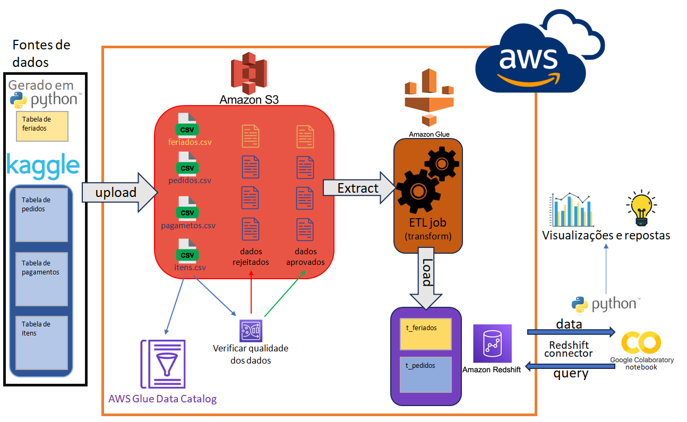

# MVP_Vendas_Cloud_ETL

Trabalho feito para o curso de "Ciência de Dados e Analytics". Formato de Python Notebook comentado. Notebook principal pode ser visualizado no [Google Colab](https://colab.research.google.com/drive/1D-gSDYsktmW317K2f6l3EWuNMkI9rQTE?usp=sharing) .

Neste projeto foi feito um ETL com AWS e python. Após armazenar parte dos [dados de uma loja de e-commerce](https://www.kaggle.com/datasets/olistbr/brazilian-ecommerce) em um S3 bucket da AWS, foi verificada a qualidade dos dados e as observações aprovadas foram transformados utilizando o AWS Glue e armazenados no Amazon Redshift. Ao final, os dados foram acessados utilizando a API do Redshift e foram visualizados no próprio Notebook Python.

Características do problema e técnicas relevantes utilizadas no projeto:
- ETL com AWS
- Tratamento e qualidade de dados
- Banco de dados relacional
- S3 Bucket, AWS Glue, Data Catalog, Amazon Redshift
- Redshift API
- SQL
- Visualização de dados
